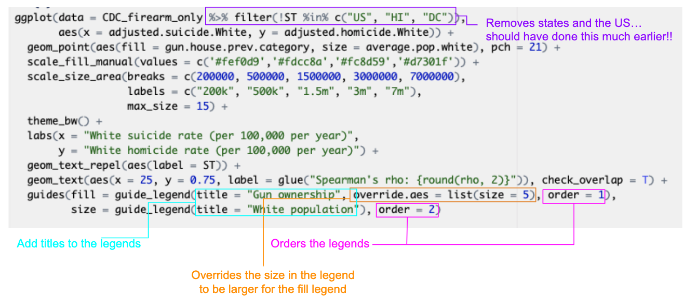

### You got this.

1. Don't worry about making it exactly, try and see how far you can get. 
2. You're encouraged to work together if you want to and exchange tips/tricks 
you figured out. 

### I'll leave these here

* https://cran.r-project.org/web/packages/ggrepel/vignettes/ggrepel.html

* http://colorbrewer2.org

* You may need to use some `dplyr` skills from the first session

### Build Figure 3: First add the points

```{r add-points, warning=F, message=F, out.width="80%"}
library(tidyverse)
CDC_Males <- read_csv("./data/CDC_Males.csv")
ggplot(data = CDC_Males, 
       aes(x = adjusted.suicide.White, y = adjusted.homicide.White)) +
  geom_point()
```

### Build Figure 3: Are there too many points?

Notice there are too many points. Use the `dplyr` function called `filter` to
subset to the firearm homicide and suicides only:

```{r, out.width="80%"}
CDC_firearm_only <- CDC_Males %>% filter(type == "Firearm") 

ggplot(data = CDC_firearm_only, aes(x = adjusted.suicide.White, y = adjusted.homicide.White)) +
  geom_point()
```

### Build Figure 3: Color according to state gun prevalence

Link color to state gun prevalence. Try both continuous and categorical variables
to see the difference. Remember, you need to do this inside the `aes()` function!
Try putting it outside the aes() and see what happens. 

i) Categorical version

```{r, out.width="80%"}
#why is categorical data colours in a non-ordered way?
#do we want it to be ordered here?
ggplot(data = CDC_firearm_only, 
       aes(x = adjusted.suicide.White, y = adjusted.homicide.White)) +
  geom_point(aes(col = gun.house.prev.category))
```

### Build Figure 3: Color according to state gun prevalence

ii) Continuous version

```{r, out.width="80%"}
# what is misleading here about the default?
# the darkest colours correspond to the lower values. Confusing!
ggplot(data = CDC_firearm_only, 
       aes(x = adjusted.suicide.White, y = adjusted.homicide.White)) +
  geom_point(aes(col = gun.house.prev)) 
```

### Build Figure 3: Color according to state gun prevalence

Set the colors manually. Do this inside of the scale function:

```{r, out.width="80%"}
ggplot(data = CDC_firearm_only, 
       aes(x = adjusted.suicide.White, y = adjusted.homicide.White)) +
  geom_point(aes(col = gun.house.prev.category)) +
  scale_color_manual(values = c('#fef0d9','#fdcc8a','#fc8d59','#d7301f'))
```

### Build Figure 3: Link to size

```{r, out.width="80%"}
ggplot(data = CDC_firearm_only, 
       aes(x = adjusted.suicide.White, y = adjusted.homicide.White)) +
  geom_point(aes(col = gun.house.prev.category, size = average.pop.white)) +
  scale_color_manual(values = c('#fef0d9','#fdcc8a','#fc8d59','#d7301f')) 
```

### Build Figure 3: Tell the size legend where to show the breaks

```{r, out.width="80%"}
ggplot(data = CDC_firearm_only, 
       aes(x = adjusted.suicide.White, y = adjusted.homicide.White)) +
  geom_point(aes(col = gun.house.prev.category, size = average.pop.white)) +
  scale_color_manual(values = c('#fef0d9','#fdcc8a','#fc8d59','#d7301f')) +
  scale_size_area(breaks = c(200000, 500000, 1500000, 3000000, 7000000))
```

### Build Figure 3: Make the max size of the circles larger

```{r, out.width="80%"}
ggplot(data = CDC_firearm_only, 
       aes(x = adjusted.suicide.White, y = adjusted.homicide.White)) +
  geom_point(aes(col = gun.house.prev.category, size = average.pop.white)) +
  scale_color_manual(values = c('#fef0d9','#fdcc8a','#fc8d59','#d7301f')) +
  scale_size_area(breaks = c(200000, 500000, 1500000, 3000000, 7000000), 
                  max_size = 15)
```

### Build Figure 3: Add some tiny changes

* add the x and y axis labels inside `labs()`
* change the type of plotting point using `pch`. Then need to use fill instead of color for pch=21 (since this pch has both a fill and an outline)

```{r, out.width="80%"}
ggplot(data = CDC_firearm_only, 
       aes(x = adjusted.suicide.White, y = adjusted.homicide.White)) +
  geom_point(aes(fill = gun.house.prev.category, size = average.pop.white), pch = 21) +
  scale_fill_manual(values = c('#fef0d9','#fdcc8a','#fc8d59','#d7301f')) +
  scale_size_area(breaks = c(200000, 500000, 1500000, 3000000, 7000000), 
                  max_size = 15) + 
  theme_bw() +
  labs(x = "White suicide rate (per 100,000 per year)", 
       y = "White homicide rate (per 100,000 per year)")
```

### Build Figure 3: Add state labels with geom_text() or geom_label(). 

Try both and see how they differ.

```{r, out.width="80%"}
ggplot(data = CDC_firearm_only, 
       aes(x = adjusted.suicide.White, y = adjusted.homicide.White)) +
  geom_point(aes(fill = gun.house.prev.category, size = average.pop.white), pch = 21) +
  scale_fill_manual(values = c('#fef0d9','#fdcc8a','#fc8d59','#d7301f')) +
  scale_size_area(breaks = c(200000, 500000, 1500000, 3000000, 7000000), 
                  max_size = 15) + 
  theme_bw() +
  labs(x = "White suicide rate (per 100,000 per year)", 
       y = "White homicide rate (per 100,000 per year)") +
  geom_label(aes(label = ST))
```

### Build Figure 3: Introducing `ggrepel`

Use the package ggrepel to repel these labels away from one another and away from
the data so they don't appear so crowded. Need to change geom_text (or geom_label)
to geom_text_repel

```{r, out.width="80%"}
#install.packages("ggrepel")
library(ggrepel) # you may need to install this package!

ggplot(data = CDC_firearm_only, 
       aes(x = adjusted.suicide.White, y = adjusted.homicide.White)) +
  geom_point(aes(fill = gun.house.prev.category, size = average.pop.white), pch = 21) +
  scale_fill_manual(values = c('#fef0d9','#fdcc8a','#fc8d59','#d7301f')) +
  scale_size_area(breaks = c(200000, 500000, 1500000, 3000000, 7000000), 
                  max_size = 15) + 
  theme_bw() +
  labs(x = "White suicide rate (per 100,000 per year)", 
       y = "White homicide rate (per 100,000 per year)") +
  geom_text_repel(aes(label = ST))
```

### Build Figure 3: Calculate Spearman's rank

Use this `dplyr` code to calculate the spearman's rank statistic and call it rho

```{r, out.width="80%"}
corr <- cor.test(x = CDC_firearm_only %>% 
                   filter(! ST %in% c("US", "HI", "DC")) %>% 
                   select(adjusted.homicide.White) %>% 
                   unlist(), 
                 y = CDC_firearm_only %>% 
                   filter(! ST %in% c("US", "HI", "DC")) %>% 
                   select(adjusted.suicide.White) %>% 
                   unlist(), 
                 method = 'spearman')

corr

rho <- corr$estimate
```

### Build Figure 3: Introducing the glue `package`

`Glue` is a great package for gluing together words with variables:

```{r message=FALSE, warning=FALSE, out.width="80%"}
#install.packages("glue")
library(glue) #you may need to install this package!
glue("The Spearman's rank coefficient is:{rho}")

glue("The Spearman's rank coefficient is:{round(rho, 2)}")
```

### Build Figure 3: Add Spearman's rank to the plot

Add rho to the plot using `geom_text()`:

* You need to supply x and y in this `aes()` to tell the text where to plot it
* You need to also say check_overlap = T or else it will plot it for each row of the data and appear bolded (try removing check_overlap =  T)

```{r, out.width="80%"}
ggplot(data = CDC_firearm_only, 
       aes(x = adjusted.suicide.White, y = adjusted.homicide.White)) +
  geom_point(aes(fill = gun.house.prev.category, size = average.pop.white), pch = 21) +
  scale_fill_manual(values = c('#fef0d9','#fdcc8a','#fc8d59','#d7301f')) +
  scale_size_area(breaks = c(200000, 500000, 1500000, 3000000, 7000000), 
                  max_size = 15) + 
  theme_bw() +
  labs(x = "White suicide rate (per 100,000 per year)", 
       y = "White homicide rate (per 100,000 per year)") +
  geom_text_repel(aes(label = ST)) +
  geom_text(aes(x = 25, y = 0.75, label = glue("Spearman's rho: {round(rho, 2)}")), check_overlap = T)
```

### Build Figure 3: Make the legend pretty

* The next slide annotates this code to show which bits affect the legend.

```{r, out.width="80%"}
ggplot(data = CDC_firearm_only %>% filter(!ST %in% c("US", "HI", "DC")), 
       aes(x = adjusted.suicide.White, y = adjusted.homicide.White)) +
  geom_point(aes(fill = gun.house.prev.category, size = average.pop.white), pch = 21) +
  scale_fill_manual(values = c('#fef0d9','#fdcc8a','#fc8d59','#d7301f')) +
  scale_size_area(breaks = c(200000, 500000, 1500000, 3000000, 7000000), 
                  labels = c("200k", "500k", "1.5m", "3m", "7m"),
                  max_size = 15) + 
  theme_bw() +
  labs(x = "White suicide rate (per 100,000 per year)", 
       y = "White homicide rate (per 100,000 per year)") +
  geom_text_repel(aes(label = ST)) +
  geom_text(aes(x = 25, y = 0.75, label = glue("Spearman's rho: {round(rho, 2)}")), check_overlap = T) +
  guides(fill = guide_legend(title = "Gun ownership", override.aes = list(size = 5), order = 1),
         size = guide_legend(title = "White population"), order = 2)
  

```

### Build Figure 3: Make the legend pretty

```{r explain-changes, echo=FALSE, out.width = '90%'}

```

### Save figure 3

This code will only work if you add a Plots folder inside of your main folder!

```{r save-figures}
figure.3 <- ggplot(data = CDC_firearm_only %>% filter(!ST %in% c("US", "HI", "DC")), 
       aes(x = adjusted.suicide.White, y = adjusted.homicide.White)) +
  geom_point(aes(fill = gun.house.prev.category, size = average.pop.white), pch = 21) +
  scale_fill_manual(values = c('#fef0d9','#fdcc8a','#fc8d59','#d7301f')) +
  scale_size_area(breaks = c(200000, 500000, 1500000, 3000000, 7000000), 
                  labels = c("200k", "500k", "1.5m", "3m", "7m"),
                  max_size = 15) + 
  theme_bw() +
  labs(x = "White suicide rate (per 100,000 per year)", 
       y = "White homicide rate (per 100,000 per year)") +
  geom_text_repel(aes(label = ST)) +
  geom_text(aes(x = 25, y = 0.75, label = glue("Spearman's rho: {round(rho, 2)}")), check_overlap = T) +
  guides(fill = guide_legend(title = "Gun ownership", override.aes = list(size = 5), order = 1),
         size = guide_legend(title = "White population"), order = 2)

ggsave(filename = "./misc/figure3.jpeg", plot = figure.3, device = "jpeg", width = 8, height = 6, units = "in")
```


