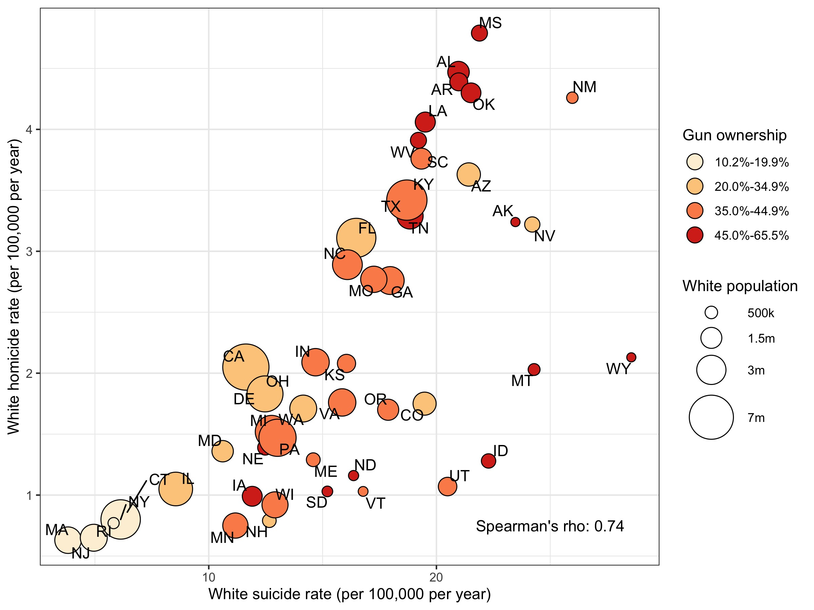

### Exercise

* The purpose of this exercise is to make a publication-ready plot using your
`dplyr` and `ggplot2` skills. 

* Open the journal article "misc/Riddell_Annals_Hom-Sui-Disparities.pdf"
Read the abstract and have a look at Figure 3.

* The data you need to make this plot is "data/CDC_Males.csv"

* You'll have 45 minutes to see what you can come up with in groups or individually!

### You got this.

1. Don't worry about making it exactly, try and see how far you can get. 
2. You're encouraged to work together if you want to and exchange tips/tricks 
you figured out. 

### I'll leave these here

* https://cran.r-project.org/web/packages/ggrepel/vignettes/ggrepel.html

* http://colorbrewer2.org

* You may need to use some `dplyr` skills from the first session


### Figure 3

```{r, out.width="80%", fig.align='center', echo=F}

```
